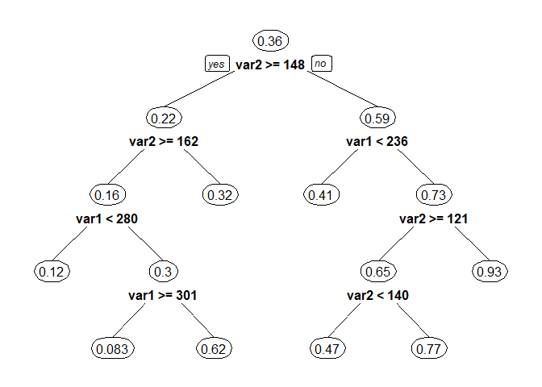

<!-- README.md is generated from README.Rmd. Please edit that file -->

# heaRt R package

### Written by Anna Signorini, Lucrezia Bonifazi, and Nicola Ruaro

<!-- badges: start -->

<!-- badges: end -->

## Description

**heaRt** is an R package for analyzing and modelling clinical data
related to heart disease diagnosis.

The package downloads and processes the Cleveland Heart Disease dataset
from the UCI Machine Learning Repository, allows the user to select
relevant clinical variables, fits different statistical and machine
learning models, and produces informative plots of the fitted results.

Three functions are provided:

1.  `load_heaRt()`: downloads the heart disease dataset, filters
    observations according to diagnosis severity, and returns a tidy
    object of class “heaRt”,

2.  a `fit()` method: for fitting predictive models (decision trees,
    logistic regression, random forests, and linear regression) to
    “heaRt” objects. The user can choose whether to fit models with one
    or two predictors,

3.  and a `plot()` method for producing nice visualisations depending on
    the fitted model (decision tree plots, partial dependence plots, or
    regression curves) based on`ggplot2`.

Typically, these functions are applied sequentially. A demonstration of
the typical workflow of the `heaRt` package follows below.

## Installation

You can install the development version of heaRt from
[GitHub](https://github.com/) with:

``` r
# install.packages("pak")
pak::pak("nic-ru/heaRt")
```

## Example

This is a basic example which shows how to fit a logistic regression
model to clinical heart disease data using resting blood pressure and
resting ECG measurements:

``` r
library(heaRt)
# modificare quando funziona
model <- fit(
  load_heaRt(vars = "chol-mhr"),
  num_var = "2",
  fit_type = "decision.tree"
)
#> Rows: 303 Columns: 14
#> ── Column specification ────────────────────────────────────────────────────────
#> Delimiter: ","
#> dbl (14): X1, X2, X3, X4, X5, X6, X7, X8, X9, X10, X11, X12, X13, X14
#> 
#> ℹ Use `spec()` to retrieve the full column specification for this data.
#> ℹ Specify the column types or set `show_col_types = FALSE` to quiet this message.
#> n= 255 
#> 
#> node), split, n, deviance, yval
#>       * denotes terminal node
#> 
#>  1) root 255 58.5254900 0.35686270  
#>    2) var2>=147.5 162 28.0000000 0.22222220  
#>      4) var2>=161.5 96 12.6562500 0.15625000  
#>        8) var1< 279.5 76  7.9342110 0.11842110 *
#>        9) var1>=279.5 20  4.2000000 0.30000000  
#>         18) var1>=301 12  0.9166667 0.08333333 *
#>         19) var1< 301 8  1.8750000 0.62500000 *
#>      5) var2< 161.5 66 14.3181800 0.31818180 *
#>    3) var2< 147.5 93 22.4731200 0.59139780  
#>      6) var1< 235.5 41  9.9512200 0.41463410 *
#>      7) var1>=235.5 52 10.2307700 0.73076920  
#>       14) var2>=120.5 37  8.4324320 0.64864860  
#>         28) var2< 139.5 15  3.7333330 0.46666670 *
#>         29) var2>=139.5 22  3.8636360 0.77272730 *
#>       15) var2< 120.5 15  0.9333333 0.93333330 *
```

Note that the data are dynamically obtained from the UCI Machine
Learning Repository, hence the need for `load_heaRt()` to always access
the original clinical dataset.

Subsequently, a graphical representation of the fitted model can be
created:

``` r
# chimare il modello come quello della vignetta
plot(model)
```



A more thorough introduction is provided in the `heaRt` vignette.
